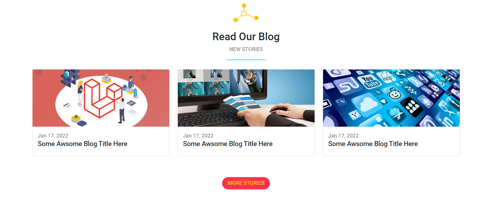

# Bondi-Template

I created this template during my learning process with Bootstrap to deepen my understanding of the framework.

### Preview

###### Landing Section :

###### Features Section :

###### Our Wrok Section :

###### Stuff Section :

###### Team Section :

###### Tech And Project Sections :

###### Blog Section :

###### Subscribe And Footer Sections :

### Links:

- [Live Preview](https://mohammedbahamid.github.io/Bondi-Template/)
